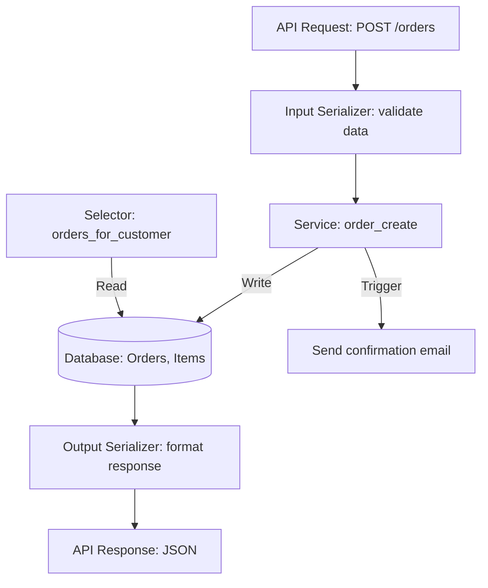

# 🧭 Clean Django Architecture Sans Sur-Ingénierie
### S’inspirer de Clean Architecture, DDD et Service Layer Pattern

---

## 1. Le problème avec le Django “traditionnel”  

Django est un framework excellent pour créer rapidement une application fonctionnelle. Mais cette rapidité peut produire des dérives :  

- **Views surchargées** avec des règles métier, validations et appels externes.  
- **Sérializers trop lourds**, qui mélangent validation et logique métier complexe.  
- **Modèles “dieux”**, qui stockent des données, valident, calculent et déclenchent des effets de bord (emails, notifications).  
- **Signals cachés**, qui rendent la compréhension du flux difficile.  

👉 Résultat : une base de code rapide à livrer, mais difficile à maintenir et à tester à mesure que l’application grandit.  

---

## 2. Principes d’architecture modernes  

Avant d’entrer dans le concret avec Django, rappelons trois **concepts fondamentaux** de l’architecture logicielle qui inspirent de bonnes pratiques.  

### 2.1 Clean Architecture (Uncle Bob)  
- **But** : séparer la logique métier du framework et de l’infrastructure.  
- **Idée clé** : le domaine (les règles métier) doit être indépendant de la base de données, du framework web, et des outils externes.  
- **Avantage** : testabilité, portabilité, flexibilité face aux changements techniques.  
- **Application Django** : ne pas mettre la logique métier dans les views, models ou serializers, mais dans des services indépendants.  

---

### 2.2 Domain Driven Design (DDD)  
- **But** : placer la **logique métier** et le **vocabulaire du domaine** au centre du logiciel.  
- **Idée clé** :  
  - Modéliser les objets métier tels qu’ils existent dans la réalité.  
  - Expliciter les règles métier via des **services de domaine**.  
  - Construire un langage commun entre développeurs et experts métier.  
- **Application Django** : créer des services clairs (`order_create`, `payment_charge`) qui reflètent des actions métier compréhensibles.  

---

### 2.3 Service Layer Pattern  
- **But** : centraliser la logique métier dans une couche dédiée (les services).  
- **Idée clé** :  
  - Les **services** orchestrent les opérations complexes.  
  - Les **selectors** gèrent la lecture optimisée des données.  
  - Les **APIs** se contentent de valider et d’appeler ces services.  
- **Application Django** : utiliser des fonctions/services explicites pour toute opération métier.  

---

## 3. Concepts appliqués à Django  

Nous allons appliquer ces principes à un cas concret : **la gestion de commandes e-commerce**.  

Un client peut passer une commande avec plusieurs produits.  
Lors de la création d’une commande, il faut :  
- valider les données,  
- créer la commande et ses lignes,  
- envoyer un email de confirmation.  

---

## 4. Exemple complet : E-commerce Order Flow  

### 4.1 Models : structure de données simple  

```python
# models.py
from django.db import models
from django.core.exceptions import ValidationError

class Customer(models.Model):
    email = models.EmailField(unique=True)
    name = models.CharField(max_length=255)

class Product(models.Model):
    name = models.CharField(max_length=255)
    price = models.DecimalField(max_digits=10, decimal_places=2)

class Order(models.Model):
    customer = models.ForeignKey(Customer, on_delete=models.CASCADE)
    created_at = models.DateTimeField(auto_now_add=True)

    def clean(self):
        if not self.customer:
            raise ValidationError("Order must have a customer")

class OrderItem(models.Model):
    order = models.ForeignKey(Order, on_delete=models.CASCADE, related_name="items")
    product = models.ForeignKey(Product, on_delete=models.CASCADE)
    quantity = models.PositiveIntegerField(default=1)
```

👉 Les **models** décrivent uniquement les données et quelques validations simples.  
Ils ne doivent pas contenir de logique métier lourde.  

---

### 4.2 Service : créer une commande  

```python
# services/orders.py
from django.db import transaction
from .models import Order, OrderItem

@transaction.atomic
def order_create(*, customer, products_data) -> Order:
    '''
    Create an order with items, validate input and send confirmation.
    '''
    order = Order.objects.create(customer=customer)

    for product, quantity in products_data:
        OrderItem.objects.create(order=order, product=product, quantity=quantity)

    send_order_confirmation_email(customer=customer, order=order)

    return order
```

👉 Le **service** gère la transaction, applique les règles métier et déclenche les effets de bord (email).  
Il est **indépendant** de la vue ou du serializer.  

---

### 4.3 Selector : lecture optimisée  

```python
# selectors/orders.py
from .models import Order

def orders_for_customer(*, customer):
    return (
        Order.objects.filter(customer=customer)
        .prefetch_related("items__product")
        .order_by("-created_at")
    )
```

👉 Le **selector** centralise la lecture et optimise les requêtes (via `prefetch_related`).  

---

### 4.4 API : simple interface  

```python
# apis/orders.py
from rest_framework.views import APIView
from rest_framework.response import Response
from rest_framework import serializers, status
from ..services.orders import order_create

class OrderCreateApi(APIView):
    class InputSerializer(serializers.Serializer):
        customer_id = serializers.IntegerField()
        products = serializers.ListField(
            child=serializers.DictField(
                child=serializers.IntegerField(),
                help_text="List of {'product_id': int, 'quantity': int}"
            )
        )

    def post(self, request):
        serializer = self.InputSerializer(data=request.data)
        serializer.is_valid(raise_exception=True)

        customer_id = serializer.validated_data["customer_id"]
        products_data = [
            (p["product_id"], p["quantity"]) for p in serializer.validated_data["products"]
        ]

        order = order_create(customer=customer_id, products_data=products_data)

        return Response({"order_id": order.id}, status=status.HTTP_201_CREATED)
```

👉 L’API est **mince** : elle valide, appelle le service, retourne une réponse.  

---

## 5. Workflow global (diagramme)  



---

## 6. Bonnes pratiques  

- **Services** : toujours transactionnels (`@transaction.atomic`).  
- **Selectors** : optimisés (`select_related`, `prefetch_related`).  
- **Models** : données + validations simples seulement.  
- **APIs** : interfaces claires, sans logique métier.  
- **Tests** : refléter l’architecture (services, selectors, APIs).  

---

## 7. Pièges courants  

- Logique métier cachée dans les **serializers**.  
- Abus des **signals** pour gérer des règles métier invisibles.  
- Modèles trop “intelligents” qui déclenchent des effets de bord.  
- Absence de transactions pour des opérations critiques.  

---

## 8. Comparaison avec les approches globales  

- **Clean Architecture** : ici, la logique métier (services/selectors) est découplée des frameworks (Django REST Framework, ORM).  
- **DDD** : les services reflètent directement des actions métier (`order_create`, `payment_charge`) → langage commun avec les experts métier.  
- **Service Layer Pattern** : la logique est centralisée dans une couche claire (services) au lieu d’être dispersée dans views/models.  

---

## ✅ Conclusion  

Une architecture Django claire et maintenable repose sur **trois principes** :  
1. **Séparer la logique métier** du framework (Clean Architecture).  
2. **Exprimer le domaine métier explicitement** (DDD).  
3. **Centraliser les règles métier** dans une couche claire (Service Layer).  

👉 En pratique :  
- Models = structure.  
- Services = logique métier + transactions.  
- Selectors = lecture optimisée.  
- APIs = simples interfaces.  

C’est une approche **équilibrée** : simple à comprendre, facile à tester, robuste à long terme.  
